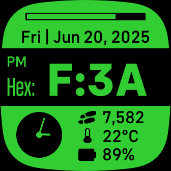

# Hex Clock
A Fitbit watch-face that displays the time in a hexadecimal format. 

Additional features include: a progress bar for daily step goal, date, a small analog clock, steps, temperature (Celsius or Fahrenheit), and battery percentage. The color of the watch-face can be changed in the watch-face settings screen in the phone's Fitbit app. The main time display can display the current time in 12 or 24 hour display based on general Fitbit settings. 

The watch-face features three main modes. The default main mode, "Hexadecimal" in which the time is displayed in hexadecimal. In hexadecimal mode a "Hex:" label is displayed to the left of the time, as a reminder that the time is in shown in hexadecimal. In "Standard Decimal" mode the time is shown in the usual decimal numbers, and a "Dec:" label is displayed to the left of the time to indicate the mode. In "Full hexadecimal" all numbers on the watch screen are shown in hexadecimal. This includes day of the month, year, time, steps, temperature, and battery percentage. In full hexadecimal mode the "Hex:" label to the left of the current time is displayed with an underline. 

Note: The watch-face should be selected and running on the phone while changing the Number Mode and color within the phone app. If the watch-face is not currently running on the Fitbit watch, then the setting changes might not take on the watch.

NOTE: This watch-face is still in development and not yet submitted to app store. 

[Fitbit App Gallery listing](https://gallery.fitbit.com/details/2332fe64-124f-4c94-852f-7686552522af?key=4a38aea7-998b-4bd0-b2fa-9abdad2b91b4)

---
Settings panel for watch-face in Fitbit phone app: 

Troubleshooting: If the temperature does not show up: 
- Ensure that watch-face permissions are enabled. 
- Ensure that Fitbit app permissions on phone, including location services and background refresh, are enabled. 
- Try toggling on and off location services and background refresh permissions for Fitbit app on your phone. 
- Try reinstalling watch-face. 
- Try turning on and off on your phone. 
- Perform synching after above steps.

Troubleshooting: Switching between Celsius and Fahrenheit:
1. In Fitbit phone app, on "Today" screen, click on profile picture -> Fitbit settings -> Date, Time & units -> UNITS OF MEASUREMENT.
2. An option to switch between Celsius and Fahrenheit is available across from Temperature. However, it may be necessary to toggle the Length value between "Feet, Miles" and "Centimeters, Kilometers" to actually toggle between Fahrenheit and Celsius in the Night Shift watch face. This seems to be an issue with the Fitbit software. 
